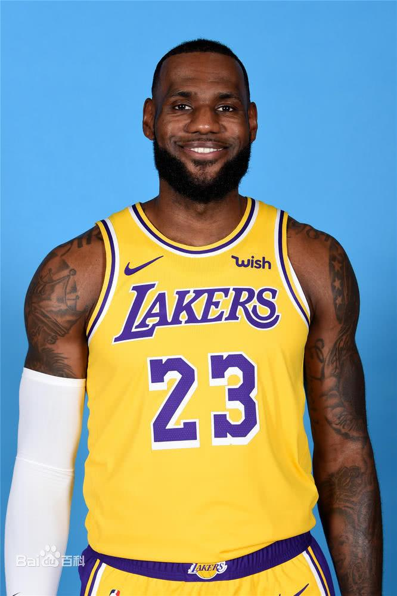

# 勒布朗詹姆斯

曾效力球队

1. 骑士
2. 热火
3. 湖人

重要事件

* 2003年NBA选秀状元
* 2010年加盟迈阿密热火队
* 2014年重回克利夫兰骑士队
* 2016年夺得克利夫兰骑士队队史首冠
* 2018年加盟洛杉矶湖人队

个人简介[官方网址](https://baike.baidu.com/item/%E5%8B%92%E5%B8%83%E6%9C%97%C2%B7%E8%A9%B9%E5%A7%86%E6%96%AF/1989503?fromtitle=%E5%8B%92%E5%B8%83%E6%9C%97%E8%A9%B9%E5%A7%86%E6%96%AF&fromid=4795214&fr=aladdin)



```javascript
console.log(湖人总冠军)
```